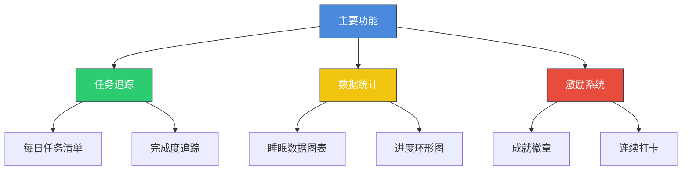
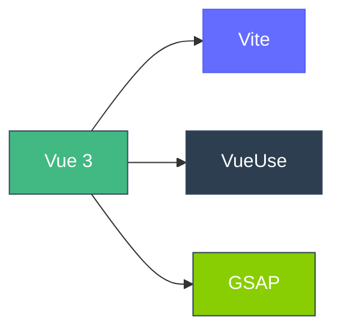
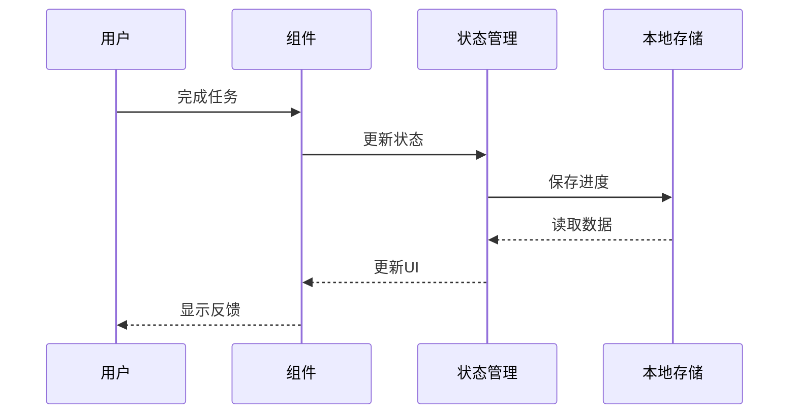

# 健康睡眠计划追踪应用

一个帮助用户建立健康睡眠习惯的Vue3应用，通过任务追踪、数据可视化和成就系统来激励用户坚持30天的睡眠改善计划。

## 功能特点



### 核心功能

1. **任务追踪系统**
   - 每日睡眠任务清单
   - 实时进度追踪
   - 任务完成度统计

2. **数据可视化**
   - 环形进度指示器
   - 睡眠数据趋势图表
   - 直观的完成度展示

3. **激励机制**
   - 成就徽章系统
   - 连续打卡记录
   - 每日激励语录

## 技术栈



- **Vue 3**: 核心框架
- **Vite**: 构建工具
- **VueUse**: 实用组合式API集合
- **GSAP**: 动画效果库

## 项目结构

```
├── src/
│   ├── components/        # 可复用组件
│   │   ├── ProgressRing   # 进度环形图
│   │   ├── TaskList      # 任务列表
│   │   └── ...
│   ├── views/            # 页面组件
│   └── App.vue          # 根组件
├── public/              # 静态资源
└── package.json        # 项目配置
```

## 使用指南

1. 安装依赖：
```bash
npm install
```

2. 启动开发服务器：
```bash
npm run dev
```

3. 构建生产版本：
```bash
npm run build
```

## 数据流



## 贡献

欢迎提交问题和改进建议！

## 许可

MIT License