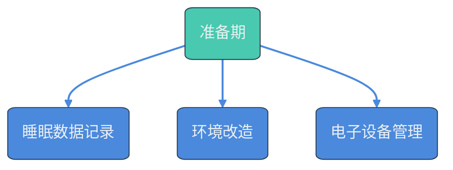
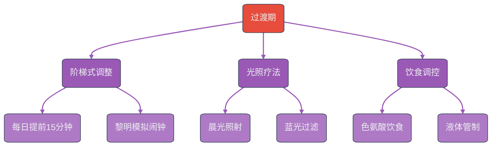
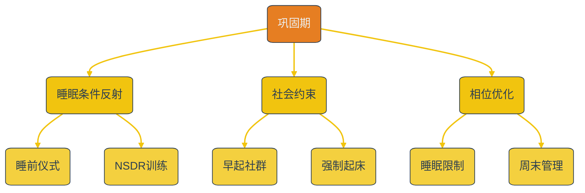
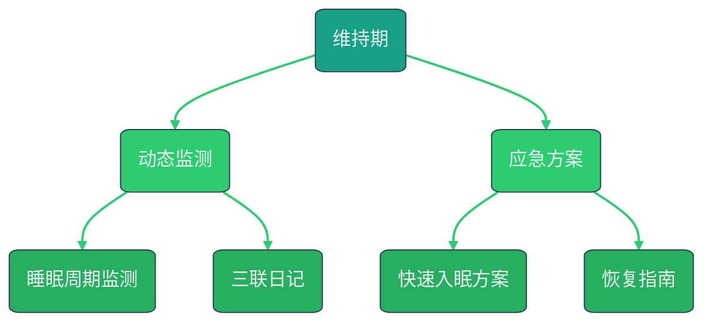

# 告别熬夜：30天早睡早起养成计划

**第一阶段：准备期（1-3天）**

1. **绘制睡眠图谱**：用智能手表或Sleep Cycle等APP连续记录3天完整的睡眠数据，标注入睡困难点（如手机使用、焦虑时段）
2. **环境改造**：
   - 更换遮光率99%的窗帘，床头安装3000K暖光阅读灯
   - 购置恒温睡垫（建议设定24℃）和降噪耳塞
3. **设立「电子宵禁」**：设置21:30自动启用手机灰度模式，22:00启动勿扰模式

**第二阶段：过渡期（第4-14天）**

1. **阶梯式调整法**：
   - 每日就寝时间提前15分钟，同步唤醒时间（如1:00→12:45→12:30）
   - 使用黎明模拟闹钟，设置唤醒前30分钟开始模拟日出
2. **光照疗法**：
   - 起床后立即接受10000勒克斯光照10分钟（可用专业灯箱）
   - 傍晚18点后佩戴蓝光过滤眼镜（推荐SAD lamp专用款）
3. **饮食调控**：
   - 晚餐增加富含色氨酸食物（香蕉、坚果、禽类）
   - 19点后实行「液体管制」，避免夜间频繁起夜

**第三阶段：巩固期（第15-30天）**

1. **建立睡眠条件反射**：
   - 设计20分钟睡前仪式：冥想（使用Headspace的睡眠专题）→ 温水足浴（42℃）→ 纸质书阅读
   - 每周3次进行NSDR（非睡眠深度休息）训练，强化身体节律
2. **社会约束机制**：
   - 加入早起社群（如Zoom早自习室），缴纳契约押金
   - 预约早晨8点的健身私教课，建立强制起床机制
3. **相位响应曲线优化**：
   - 每周四进行睡眠限制疗法，将卧床时间压缩至5小时，增强睡眠驱动力
   - 周末作息浮动不超过1小时，避免社交时差（social jetlag）

**第四阶段：维持期（31天起）**

1. **动态监测系统**：
   - 每月使用Oura Ring监测睡眠周期，根据REM占比调整运动强度
   - 建立睡眠-情绪-效率三联日记，识别作息波动诱因
2. **应急方案库**：
   - 准备3种快速入眠方案：4-7-8呼吸法/渐进肌肉放松/ASMR音频
   - 制定「破戒后恢复指南」：若意外熬夜，次日坚持正常起床，通过午间30分钟NASA式小睡补偿

**神经科学原理应用**：
- 利用体温调节：睡前90分钟进行42℃水温泡澡，促使核心体温下降促眠
- 调控腺苷代谢：下午14点后避免咖啡因，防止腺苷受体被阻断
- 优化皮质醇节律：晨起后立即进行5分钟高强度间歇运动，提升皮质醇峰值

**常见问题解决方案**：
1. **夜间思维反刍**：设置「焦虑记事本」于床头，书写后立即合上物理隔离
2. **社交干扰**：创建自动化回复模板：「正在执行睡眠改善计划，22:30后消息次日回复」
3. **生物钟反弹**：每季度进行3天「露营疗法」，通过自然光照重置昼夜节律

需要特别注意的是，整个调整过程中睡眠效率（实际睡眠时间/卧床时间）应维持在85%以上，若连续3天低于75%需回调一个阶段。建议配合维生素D3（2000IU/日）和镁剂（甘氨酸镁200mg/日）补充，优化神经传导功能。

执行此方案时，前两周可能出现日间效能暂时性下降，这是生物钟相位前移的必经过程。可使用20分钟咖啡因午睡法（午间饮用咖啡后立即小睡）过渡，通常在第18天左右会迎来「觉醒时刻」，感受到深度睡眠增加带来的日间精力提升。